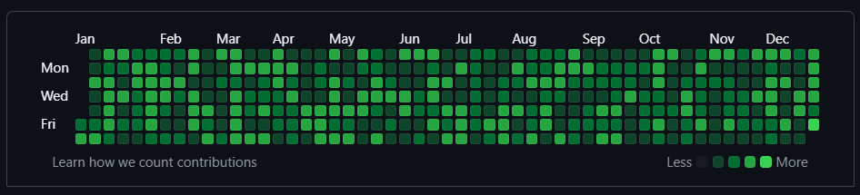

GitHub Contribution Generator
=========================
This script doesn't encourage you to cheat. Cheating is bad. But if anyone
is judging your professional skills by the graph at your GitHub profile they deserve to see a rich graph.

### Before :neutral_face:

### After :muscle: :sunglasses:


## How to use
1. Create an empty GitHub repository. Do not initialize it.
2. Install globaly
	```sh
	npm install github-contribution-generator@latest -g
	```
3. In the root of the created repository, run the command: 
	```sh
	gcg {year} {percentage}
	```
3. To generate commits on 100% of the days in 2024 you can use this command for example:
	```sh
	gcg 2024 100
	```
## How it works
Creates an empty text file in the created repository and commits changing this file to the dates of the desired year.

## Making contributions private

Set the repository to private and change it to [show private contributions.](https://help.github.com/en/articles/publicizing-or-hiding-your-private-contributions-on-your-profile).

## System requirements
To be able to execute you need to have npm and Git installed.